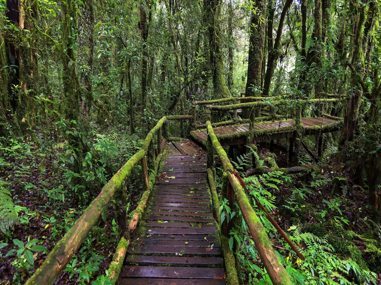
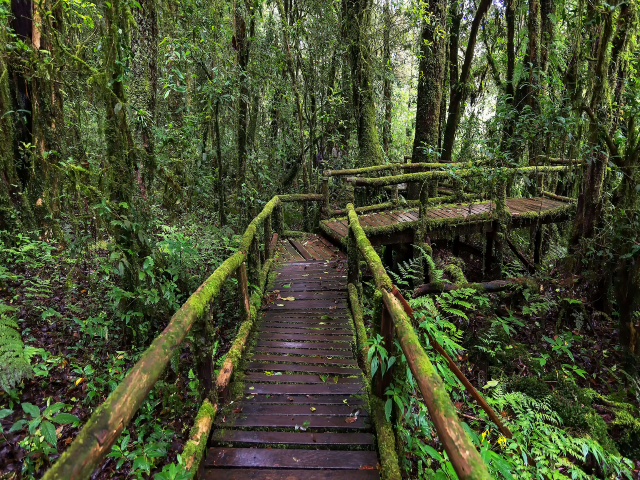
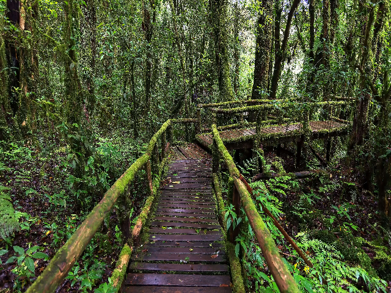

# Anti-Aliasing FIR-Based Downscaler

## Abstract

- Implemented an **anti-aliasing FIR-based downscaler** supporting fractional ratios (2×–7× horizontal, 2×–5× vertical).  
- Eliminated multipliers/dividers via **shift-based arithmetic**, achieving 100% synthesizable RTL with **0 DSP usage**.  
- Developed **SystemVerilog/Verilog verification** with image I/O, ROM checks, golden model comparison, and automated multi-resolution regression.  
- Verified across **30 resolution pairs** with 100% pixel match against the C golden model.  
- Synthesized targeting **Intel Cyclone IV (Quartus)**: 21% logic, 20% memory, 0% DSP.  
- Outperformed traditional scaling, achieving **>38.7 dB PSNR** and **~98% SSIM**.  

## Results

#### example test image: 4096x2160

---
### 4096x2160 -> 640x480
---
#### Golden method: Lanczos - generated by python library pillow

---
#### FIR-based downscaler

---
#### Baseline method: bilinear interpolation

---
#### Baseline method: nearest neighbor

---
### Synthesis
---
| Resource               | Usage          |  ---  |
|------------------------|----------------|---------|
| Total Logic Elements   | 4,395 / 21,280 |**21%** |
| - Combinational logic  | 3,989 / 21,280 |    19% |
| - Dedicated register   | 1,401 / 21,280 |    7%  |
| Embedded Multipliers   | 0 / 80         |**0%**  |
| Memory bits            | 156,768 / 774,144 |**20%** |
| Pins                   | 88 / 167       |**53%** |
| PLLs                   | 0 / 4          |**0%**  |

---
### Quality Evaluation Metrics
---
| <span style="color:gray">average</span>  | Nearest neighbor | Bilinear interpolation | FIR downscaler |
|-------------|-----------------:|-----------------------:|---------------:|
| **PSNR**    | 35.61            | 36.65                  | **38.74**      |
| **SSIM_gray** | 91.47%         | 94.26%                 | **98.17%**     |
| **SSIM_rgb**  | 90.93%         | 93.82%                 | **97.87%**     |
---
| <span style="color:red">OUTPERFORM</span> | Nearest neighbor | Bilinear interpolation |
|-------------------------------------------|-----------------:|-----------------------:|
| **PSNR**     | 3.13             | 2.09                  |
| **SSIM_gray**| 6.69%            | 3.91%                 |
| **SSIM_rgb** | 6.94%            | 4.05%                 |

---
#### benchmark dataset information
<small>

| OLD_X | OLD_Y | NEW_X | NEW_Y | Xfactor | Yfactor | samples |
|-------|-------|-------|-------|---------|---------|---------|
| 4096  | 2160  | 640   | 480   | 6.40    | 4.50    | 135     |
| 4096  | 2160  | 720   | 480   | 5.69    | 4.50    | 135     |
| 4096  | 2160  | 720   | 576   | 5.69    | 3.75    | 135     |
| 4096  | 2160  | 800   | 600   | 5.12    | 3.60    | 135     |
| 4096  | 2160  | 1024  | 768   | 4.00    | 2.81    | 135     |
| 4096  | 2160  | 1152  | 864   | 3.56    | 2.50    | 135     |
| 4096  | 2160  | 1280  | 720   | 3.20    | 3.00    | 135     |
| 4096  | 2160  | 1280  | 800   | 3.20    | 2.70    | 135     |
| 4096  | 2160  | 1280  | 960   | 3.20    | 2.25    | 135     |
| 4096  | 2160  | 1360  | 768   | 3.01    | 2.81    | 135     |
| 4096  | 2160  | 1440  | 900   | 2.84    | 2.40    | 135     |
| 4096  | 2160  | 1600  | 900   | 2.56    | 2.40    | 135     |
|-------|-------|-------|-------|---------|---------|---------|
| 3840  | 2160  | 640   | 480   | 6.00    | 4.50    | 135     |
| 3840  | 2160  | 720   | 480   | 5.33    | 4.50    | 135     |
| 3840  | 2160  | 720   | 576   | 5.33    | 3.75    | 135     |
| 3840  | 2160  | 800   | 600   | 4.80    | 3.60    | 135     |
| 3840  | 2160  | 1024  | 768   | 3.75    | 2.81    | 135     |
| 3840  | 2160  | 1152  | 864   | 3.33    | 2.50    | 135     |
| 3840  | 2160  | 1280  | 720   | 3.00    | 3.00    | 135     |
| 3840  | 2160  | 1280  | 800   | 3.00    | 2.70    | 135     |
| 3840  | 2160  | 1280  | 960   | 3.00    | 2.25    | 135     |
| 3840  | 2160  | 1360  | 768   | 2.82    | 2.81    | 135     |
| 3840  | 2160  | 1440  | 900   | 2.67    | 2.40    | 135     |
| 3840  | 2160  | 1600  | 900   | 2.40    | 2.40    | 135     |
|-------|-------|-------|-------|---------|---------|---------|
| 2560  | 1440  | 640   | 480   | 4.00    | 3.00    | 436     |
| 2560  | 1440  | 720   | 480   | 3.56    | 3.00    | 436     |
| 2560  | 1440  | 720   | 576   | 3.56    | 2.50    | 436     |
| 2560  | 1440  | 800   | 600   | 3.20    | 2.40    | 436     |
|-------|-------|-------|-------|---------|---------|---------|
| 1920  | 1080  | 640   | 480   | 3.00    | 2.25    | 309     |
| 1920  | 1080  | 720   | 480   | 2.67    | 2.25    | 309     |
|-------|-------|-------|-------|---------|---------|---------|

</small>

## Environment

### Python
```bash
python -m venv venv
# activate the venv:
#   Linux/macOS:
#  source venv/bin/activate
#   Windows (Powershell):
# .\venv\Scripts\activate

pip install -r requirements.txt
```

### Verilog
- Icarus Verilog  

### SystemVerilog
- ModelSim Starter  

### Waveform Viewer
- GTKWave  

---

## Prepare 

### 0. Put your pictures in the folder:
```bash
/your_picture_folder
```

### 1. Prepare Test Images
```bash
cd tool
python prepare_test_images.py
```
**Generates**
- `source_picture/` — your pictures with formatted names  
- `test_picture/` — input source pictures for scaling methods  
- `tool/picture_basename.txt` — a mapping list for your pictures  

---

### 2. Generate Window Data
```bash
cd algorithm
python fir_config_gen.py.py
```
**Generates**
- `rom_data/start_table` — maps the start address of each ROM zone  
- `rom_data/window_rom` — window values for the algorithm  
- `rtl_config/` — RTL configuration files  
- `prepare_data/window/` — window folder for the C golden model  

---


## Option A: Run Regression with Icarus Verilog

---

### 3. Regression (RTL + C golden)
```bash
sh run_FIR.sh
```
**Generates**
- `hex_input/` — input hex pixel data to RTL  
- `hex_output/` — output hex pixel data from RTL  
- `hex_golden/` — output hex pixel data from the C golden model  
- `output_FIR/` — resized pictures generated by RTL

---

## 4. Benchmark (Traditional Methods)
```bash
sh run_traditional.sh
```
**Generates**
- `output_bilinear/` — resized pictures using bilinear interpolation  
- `output_nearest/` — resized pictures using nearest neighbor  

---

```bash
cd benchmark
python resize_golden_method.py
```
**Generates**
- `output_goldmethod/` — resized pictures using golden method (Lanczos)  

---

## 5. Calculate Metrics
```bash
cd metrics
python benchmark_metrics.py
```
**Generates**
- `results/metric_results.xlsx` — benchmark results comparing:
  - FIR-Based Downscaler  
  - Bilinear Interpolation  
  - Nearest Neighbor  

---

## Option B: Run Testbenches 
**running example**
- test_pictures_pillow\test_3840x2160_batch_14.bmp  
- test_pictures_pillow\test_4096x2160_batch_21.bmp

### Run SystemVerilog Testbench (ModelSim)
```bash
sh run_modelsim.sh
```

### Run Verilog Testbench (Icarus Verilog)
```bash
sh run_iverilog.sh
```
